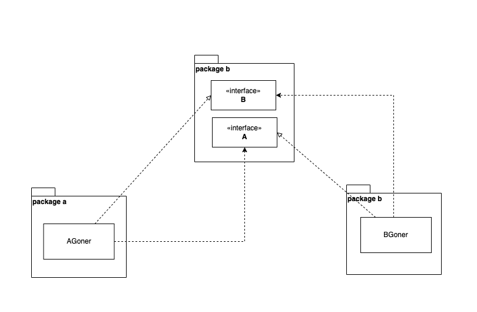

# Injection Methods Supported by Gone

[[toc]]

## Public Property Injection vs Private Property Injection
In Gone, both public property injection and private property injection are supported. Dependency injection typically restricts the "objects" to be injected to be used only within the module. Following the "open-closed" principle, I recommend using private property injection.

::: tip
Recommendation: Private Property Injection
:::

For example:
```go
package demo
import "github.com/gone-io/gone"

type Worker struct {
	gone.Flag // Goner flag, embedding `gone.Flag` anonymously indicates that this structure is a Goner
	Name      string
}

type Boss struct {
    gone.Flag // Goner flag, embedding `gone.Flag` anonymously indicates that this structure is a Goner

    seller  *Worker `gone:"seller"`  // lowercase first letter indicates private property injection, accessible only within the package
    Manager *Worker `gone:"manager"` // uppercase first letter indicates public property injection, accessible without restrictions
}
```

## Anonymous Injection vs Named Injection

### Anonymous Burial and Named Burial
To inject a Goner, it must first be loaded into the system. In Gone, this process is termed as **burial**, done in the **Priest** function by invoking the `cemetery.Bury` function to "bury" the reference of the Goner into the **cemetery**. When burying, if no GonerId is specified, it's an **anonymous burial**; if specified, it's a **named burial**.

The complete definition of the **`Cemetery.Bury`** function is as follows: **`Bury(Goner, ...GonerId) Cemetery`**. This definition is designed with two considerations:
1. It supports **named burials**, where the second parameter is optional, allowing passing a string as the **Goner**'s **ID** (**GonerId**).
2. It enables method chaining for the Bury function.

**Example:**
```go
func Priest(cemetery gone.Cemetery) error {
	cemetery.
		Bury(&AGoner{Name: "Injected Goner1"}, "A1"). // named burial for the first AGoner, ID=A1
		Bury(&AGoner{Name: "Injected Goner2"}, "A2"). // named burial for the second AGoner, ID=A2
		Bury(&BGoner{}) // anonymous burial
	return nil
}
```

::: tip
In anonymous burial, if there exist multiple compatible types of **Goner**, only one of them will be injected, typically the first one revived. This may lead to undefined behavior. For example:
```go
package main

import "github.com/gone-io/gone"

type Worker struct {
	gone.Flag // Goner flag, embedding `gone.Flag` anonymously indicates that this structure is a Goner
	Name      string
}

type Boss struct {
	gone.Flag // Goner flag, embedding `gone.Flag` anonymously indicates that this structure is a Goner

	seller *Worker `gone:"*"` // anonymous injection, if multiple Workers exist, only one will be injected, typically the first one
}

func main() {
	gone.Run(func(cemetery gone.Cemetery) error {
		cemetery.Bury(&Boss{})
		cemetery.Bury(&Worker{Name: "John"})
		cemetery.Bury(&Worker{Name: "Alice"})
		return nil
	})
}
```
:::

### Anonymous Injection
When injecting without specifying the Goner's GonerId, it's termed as anonymous injection, indicated by the injection tag `gone:"*"`. 

**Example:**
```go
type Boss struct {
    gone.Flag // Goner flag, embedding `gone.Flag` anonymously indicates that this structure is a Goner

    seller *Worker `gone:"*"` // anonymous injection
}
```
::: warning
In anonymous injection, if there are multiple compatible types of **Goner**, only one will be injected, typically the first one revived. This may lead to undefined behavior. For example:
```go
package main

import "github.com/gone-io/gone"

type Worker struct {
	gone.Flag // Goner flag, embedding `gone.Flag` anonymously indicates that this structure is a Goner
	Name      string
}

type Boss struct {
	gone.Flag // Goner flag, embedding `gone.Flag` anonymously indicates that this structure is a Goner

	seller *Worker `gone:"*"` // anonymous injection, if multiple Workers exist, only one will be injected, typically the first one
}

func main() {
	gone.Run(func(cemetery gone.Cemetery) error {
		cemetery.Bury(&Boss{})
		cemetery.Bury(&Worker{Name: "John"})
		cemetery.Bury(&Worker{Name: "Alice"})
		return nil
	})
}
```
:::

### Named Injection
When injecting with a specified GonerId, it's termed as named injection. Named injection accurately injects a Goner based on its name, which is useful in practical development. It's essential to ensure that a Goner with the corresponding GonerId is buried in the cemetery.

**Example:**
```go
type Boss struct {
    gone.Flag // Goner flag, embedding `gone.Flag` anonymously indicates that this structure is a Goner
    Manager *Worker `gone:"manager"` // named injection
}
```

## Supported Injection Property Types

### 1. Pointer Types
When the injected Goner property is a pointer, it's termed as **pointer injection**.

**Example:**
```go
type Worker struct {
	gone.Flag
	Name string
}

type Boss struct {
    gone.Flag
    seller *Worker `gone:"seller"` // pointer type
}
```

### 2. Value Types
When the injected Goner property is a value type, it's termed as **value injection**.

**Example:**
```go
type Worker struct {
	gone.Flag
	Name string
}

type Boss struct {
    gone.Flag
    seller Worker `gone:"seller"` // value type
}
```

::: warning
In Go, value types are passed by copy, meaning that when using value injection, a new "object" is created, and the old and new objects are independent in memory. This may lead to unexpected results. For example:

```go
type BGoner struct {
	gone.Flag

	a1 AGoner `gone:"A1"` // value injection
	a2 AGoner `gone:"A1"` // value injection
}

func (g *BGoner) AfterRevive() gone.AfterReviveError {
	g.a1.Name = "dapeng"
	g.a2.Name = "wang"

	fmt.Printf("a1 is eq a2: %v", g.a1 == g.a2)

	return nil
}
```
In the above code, the printed result will be `false`.
:::

### 3. Interface Types
When the injected Goner property is an interface type, it's termed as **interface injection**.

**Example:**
```go
type Seller interface {
    Sell() error
}

type Boss struct {
    gone.Flag
    seller Seller `gone:"seller"` // interface type
}
```

### 4. Slice Types
When the injected Goner property is a slice type, it's termed as **slice injection**. In slice injection, the element types of the slice can be value types, pointer types, or interface types. Due to the "copy by pass" nature of value types, it's not recommended to use them.

**Example:**
```go
type Worker struct {
	gone.Flag
	Name string
}

type Seller interface {
    Sell() error
}

type Boss struct {
    gone.Flag
    sellers []Seller  `gone:"*"` // Slice type with elements as interface types
    workers []*Worker `gone:"*"` // Slice type with elements as pointer types
    persons []Worker  `gone:"*"` // Slice type with elements as value types (not recommended)
}
```

### 5. Map Types
When the injected Goner property is a map type, it's termed as **map injection**. In map injection, the element types of the map can be value types, pointer types, or interface types. Due to the "copy by pass" nature of value types, it's not recommended to use them. The keys of the map are always of type `string`, and the value of each key is the GonerId of the injected Goner.

**Example:**
```go
type Worker struct {
	gone.Flag
	Name string
}

type Seller interface {
    Sell() error
}

type Boss struct {
    gone.Flag
    sellers map[string]Seller  `gone:"*"` // Map type with values as interface types
    workers map[string]*Worker `gone:"*"` // Map type with values as pointer types
    persons map[string]Worker  `gone:"*"` // Map type with values as value types (not recommended)
}
```

## Pointer Injection vs Interface Injection
During the Bury process of a Goner in Gone, it's required to pass a reference. Both pointer injection and interface injection can pass the reference obtained from the `Cemetery.Bury` method to the properties of a structure. **Pointer injection** is simple and straightforward, with a one-to-one correspondence between types, requiring no further explanation. **Interfaces** in Go are designed to decouple business usage from business logic implementation, allowing the usage side to be unaware of the implementation details. Interfaces also help break circular dependencies, which are not allowed in Go due to its strong typing and compile-time checks. Here's how interfaces can be used to break circular dependencies between packages:

Circular dependency:


Using interfaces to break the circular dependency:


Using interfaces helps hide implementation details, reduces coupling between modules, and adheres better to the "open-closed" principle. Therefore, **interface injection** is recommended. However, there are no absolute rules, and introducing interfaces will increase additional costs. Hence, we still support **pointer injection**.

## Slice Injection vs Map Injection
Gone supports injecting into `Slice` and `Map`, termed as **slice injection** and **map injection** respectively. In both cases, the elements of the Slice and Map can be value types, pointer types, or interface types. However, due to the "copy by pass" nature of value types, it's not recommended to use them. Here's how you can inject into Slice and Map properties:

**Injection rules are as follows:**
- Slice and Map can contain elements of Goner pointer types, Goner value types, or interfaces.
- Gone injects all compatible types of Goners into Slice and Map.
- Map keys are of type `string`, and the value of each key is the GonerId of the injected Goner. If no GonerId is specified during burial, Gone generates one.

::: warning
Using value types as Slice and Map types is not recommended.
:::

Here's a complete example:

```go
package main

import (
	"fmt"
	"github.com/gone-io/gone"
)

type AGoner struct {
	gone.Flag
	Name string
}

func (g *AGoner) Say() string {
	return fmt.Sprintf("I am the AGoner, My name is: %s", g.Name)
}

type BGoner struct {
	gone.Flag

	aSlice1 []*AGoner `gone:"*"` // Slice type with elements as Goner pointer types
	aSlice2 []AGoner  `gone:"*"` // Slice type with elements as Goner value types

	aMap1 map[string]*AGoner `gone:"*"` // Map type with values as Goner pointer types
	aMap2 map[string]AGoner  `gone:"*"` // Map type with values as Goner value types
}

// AfterRevive executed After the Goner is revived; After `gone.Run`, gone framework detects the AfterRevive function on goners and runs it.
func (g *BGoner) AfterRevive() gone.AfterReviveError {
	for _, a := range g.aSlice1 {
		fmt.Printf("aSlice1:%s\n", a.Say())
	}

	println("")

	for _, a := range g.aSlice2 {
		fmt.Printf("aSlice2:%s\n", a.Say())
	}

	println("")

	for k, a := range g.aMap1 {
		fmt.Printf("aMap1[%s]:%s\n", k, a.Say())
	}

	println("")

	for k, a := range g.aMap2 {
		fmt.Printf("aMap2[%s]:%s\n", k, a.Say())
	}

	return nil
}

// NewA1 constructs A1 AGoner
func NewA1() (gone.Goner, gone.GonerId) {
	return &AGoner{Name: "Injected Goner1"}, "A1"
}

// NewA2 constructs A2 AGoner
func NewA2() (gone.Goner, gone.GonerId) {
	return &AGoner{Name: "Injected Goner2"}, "A2"
}

func main() {

	gone.Run(func(cemetery gone.Cemetery) error {
		cemetery.
			Bury(NewA1()).
			Bury(&AGoner{Name: "Anonymous"}).
			Bury(NewA2()).
			Bury(&BGoner{})
		return nil
	})
}
```
The example produces the following output:


