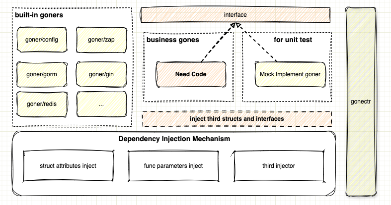

# 介绍


## Gone是什么
首先，Gone是Golang的一个轻量级的**依赖注入框架**，关于为什么需要依赖注入，我之前写了一篇文章如果感兴趣可以看看：[为什么我们需要依赖注入？ - “拒绝喝牛奶从种草养牛开始”](https://blog.csdn.net/waitdeng/article/details/138972583)。

其次，基于**Gone**的依赖注入机制，我们开发了一系列组件，比如`goner/config`和`goner/viper`可以用于读取配置文件，`goner/xorm`和`goner/gorm`可以用于访问数据库，`goner/gin`可以用于提供web服务，`goner/grpc`和`goner/urllib`可以用于调用RPC服务，`goner/logrus`和`goner/zap`可以用于日志输出...

最后，为了减少模式代码编写、测试、编译、运行，我们开发了一个命令行工具：[gonectr](https://github.com/gone-io/gonectr)。

## 特性
- 依赖注入，支持对 **结构体属性** 和 **函数参数** 的自动注入
- Gonectr，生成项目、生成辅助代码、编译和启动项目
- 单元测试方案，基于接口的mock测试
- 多种组件，可插拔，支持云原生、微服务


## 例子

下面使用**Gone**来编写一个简单的Web服务，更多例子在[快速开始](https://goner.fun/zh/quick-start/) 和 [example](https://github.com/gone-io/gone/tree/main/example)。

```go
package main

import (
	"fmt"
	"github.com/gone-io/gone"
	"github.com/gone-io/gone/goner"
)

// 实现一个Goner，什么是Goner？ => https://goner.fun/zh/guide/core-concept.html#goner-%E9%80%9D%E8%80%85
type controller struct {
	gone.Flag                  //goner 标记，匿名嵌入后，一个结构体就实现了Goner
	gone.RouteGroup `gone:"*"` //注入根路由
}

// Mount 用于挂载路由；框架会自动执行该方法
func (ctr *controller) Mount() gone.GinMountError {
	// 定义请求结构体
	type Req struct {
		Msg string `json:"msg"`
	}

	//注册 `POST /hello` 的 处理函数
	ctr.
		POST("/hello", func(in struct {
			to  string `gone:"http,query"` //注入http请求Query参数To
			req *Req   `gone:"http,body"`  //注入http请求Body
		}) any {
			return fmt.Sprintf("to %s msg is: %s", in.to, in.req.Msg)
		}).
		GET("/hello", func() string {
			return "hello"
		})

	return nil
}

func main() {
	gone.
		Default.
		LoadPriest(goner.GinPriest). //加载 `goner/gin` 用于提供web服务
		Load(&controller{}).         //加载我们前面定义的controller
		Serve()                      // 启动服务
}
```

运行上面代码：`go run main.go`，程序将监听`8080`端口，使用curl测试：
```bash
curl -X POST 'http://localhost:8080/hello?to=Tom' -H 'Content-Type: application/json' --data-raw '{"msg": "hello"}'

# 结果：{"code":0,"data":"to Tom msg is: hello"}

curl 'http://localhost:8080/hello'
# 结果： {"code":0,"data":"hello"}
```


了解更多，请阅读 [开发指南](https://goner.fun/zh/guide/)

## 关于Logo
Golang的吉祥物是一只可爱的地鼠，Gone的Logo是从它衍生出来，加上翅膀加上光圈，是一只天使地鼠，我们感觉这很复活Gone鬼故事的气质。

## 联系方式
如果您有任何问题，欢迎通过以下方式联系我们：
- [Github 讨论](https://github.com/gone-io/gone/discussions)
- 扫码加微信，暗号：gone

  