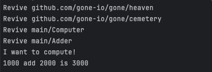
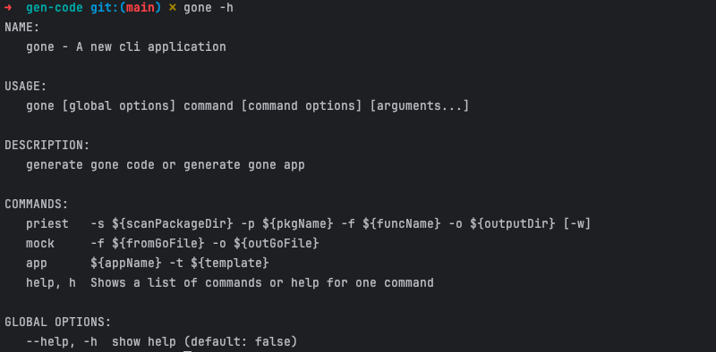

# Gone 框架介绍

## Gone是什么
Gone是一个为熟悉Spring的程序员设计的Golang框架，它整合了依赖注入和Web功能，使得在Golang中的应用程序管理和开发更加方便。该框架定义了像“Goners”（组件）、“Cemetery”（存储）和“Heaven”（运行状态）等概念，每一个都在生命周期管理和依赖处理中发挥着独特的作用。它支持依赖注入、服务生命周期管理和动态属性注入等功能，以改善开发体验。

## 为什么需要使用Gone
使用Gone框架可以带来几个重要好处，特别是对于熟悉Spring框架的Golang开发者：

- 依赖注入：Gone提供了类似Spring的依赖注入功能，让管理和配置组件变得更简单，提高了代码的模块化和可重用性。
- 服务生命周期管理：框架管理服务的整个生命周期，帮助开发者有效控制服务的创建、使用和销毁过程。
- 开发效率：通过简化配置和自动化常见任务，Gone可以加快开发速度，减少重复性工作。
- 扩展性和灵活性：Gone设计了灵活的结构，支持定制和扩展，适应不同的开发需求。

这些特性使得Gone成为一个适合快速开发高质量Golang应用程序的框架。

## Goner和依赖注入
### Goner的定义
在Gone应用中，所有的组件都被要求定义为Goner（就是“继承”了`gone.Flag`的结构体，实际上golang中根本没有“集成”这个概念，它有的只有匿名嵌套）；如果Goner的某个属性标注了`gone:""`标签，Gone框架将尝试自动装配该属性。下面是定义一个Goner的例子：
```go
package example

import "github.com/gone-io/gone"

type AGoner struct {
	gone.Flag
}
```
在另一个Goner中注入上面定义的AGoner:
```go
package example

import "github.com/gone-io/gone"

type BGoner struct{
    gone.Flag
    A *AGoner `gone:"*"` //gone标签的作用在于告诉Gone，该属性需要被自动注入一个值
}
```
其中，注入的和被注入的结构体都要求是`Goner`（也就是匿名嵌套了`gone.Flag`的结构体），`BGoner`的`A`属性的`gone:"*"`标签的作用在于告诉框架：这个属性需要被注入一个值。

### 在Gone中是如何完成依赖注入的？
在Java Spring中，给class打上`@Component`、`@Service`等标注，Spring启动时会自动扫描到这些特殊的类，然后实例化他们并且给他们有特定标注的属性注入对应的值。

Spring之所以能够实现这样的功能，Java有一个特性很关键，就是Java代码在编译成jar后，会保留所有class的字节码，哪怕是没有被`main`函数依赖的class代码；然而，在Golang中，编译后的代码会被裁剪，二进制文件中只会保留`main`函数依赖的相关代码。所以我们仅是定义Goner，在编译后我们会发现我们Goner代码全部被裁剪了。

如何让我们的**Goners**不被裁剪掉呢？答案很简单，我们显式的将所有Goner加入到一个”仓库“中；在Gone中，这个仓库叫做`Cemetery`。`Goner`有“死者”的意思；`Cemetery`是墓地，用于埋葬（Bury）`Goner`。我们可以在程序启动时，将所有的**Goner**实例化后并加入到**Cemetery**中：
```go
package main

import "example"
import "github.com/gone-io/gone"

func main() {
	gone.Run(func(cemetery gone.Cemetery) error {
        cemetery.Bury(&example.AGoner{})
		cemetery.Bury(&example.BGoner{})
        return nil
	})
}
```

在上面的代码中，我们看到`gone.Run`可以接收形式如 **`func (cemetery gone.Cemetery) error`** 的函数；实际上这个函数，我们称之为 **Priest**，是牧师的意思，他专门负责将 **Goner** 埋葬到 墓地（**Cemetery**）。

### 如何执行**Goner**中的业务代码？

在Gone中，我们做了一个有趣的定义：Goner所有属性都被注入后，我们称这个Goner被复活了（**Revive**）。如果你查看Gone的源代码，你会发现管理复活Goner状态的组件叫**Heaven**（**天堂**），这里灵感来源于各宗教神话中人死后会上天堂的传说。

为了执行**Goner**业务代码，我们可以在**Goner**上定义了方法 **`AfterRevive() gone.AfterReviveError`**，这个方法会在**Goner**被 **Revive** 后得到执行，并且我们将拥有该方法的 **Goner** 称之为 **Prophet**（也就是 **先知**）。实际上，一般情况我们只需要定义少量的先知来引导代码执行就可以了。


下面是一个例子；代码可以在[这里](https://github.com/gone-io/gone/blob/main/example/after-revive/main.go)找到：

```go
package main

import "github.com/gone-io/gone"

type Adder struct {
	gone.Flag
}

func (a *Adder) Add(a1, a2 int) int {
	return a1 + a2
}

type Computer struct {
	gone.Flag
	adder Adder `gone:"*"`
}

func (c *Computer) Compute() {
	println("I want to compute!")
	println("1000 add 2000 is", c.adder.Add(1000, 2000))
}

// AfterRevive 复活后执行的函数
func (c *Computer) AfterRevive() gone.AfterReviveError {
	// boot
	c.Compute()

	return nil
}

func main() {
	gone.Run(func(cemetery gone.Cemetery) error {
		cemetery.Bury(&Computer{})
		cemetery.Bury(&Adder{})
		return nil
	})
}
```
执行上面代码，将得到结果：  



### gone命令，自动生成`Priest`函数

实际上，前面已经讲完了Gone框架的核心功能；然而由于Golang本身的问题，我们无法做到像Spring那么方便，需要手动把所有 **`Goner`** 加入（**`Bury`**）到 **`Cemetery`**。为了让Gone使用起来更方便，我们编写了一个辅助工具来自动生成 **`Priest`** 函数。下面介绍如何在一个项目中使用这个辅助工具。

> 完整代码可以在[这里](https://github.com/gone-io/gone/blob/main/example/gen-code)找到

#### 1. 安装辅助工具: gone

辅助工具和Gone框架同名，也叫gone，可以使用`go install`进行安装，如下：

```bash
go install github.com/gone-io/gone/tools/gone@latest
```

安装后，可以执行`gone -h`命令，如果看到如下结果就是正常安装了：  



#### 2. 创建一个名为`gen-code`的新项目
```bash
mkdir gen-code
cd gen-code
go mod init gen-code
```

#### 3. 创建Goner
文件名：goner.go
```go
package main

import "github.com/gone-io/gone"

//go:gone
func NewAdder() gone.Goner {
	return &Adder{}
}

//go:gone
func NewComputer() gone.Goner {
	return &Computer{}
}

type Adder struct {
	gone.Flag
}

func (a *Adder) Add(a1, a2 int) int {
	return a1 + a2
}

type Computer struct {
	gone.Flag
	adder Adder `gone:"*"`
}

func (c *Computer) Compute() {
	println("I want to compute!")
	println("1000 add 2000 is", c.adder.Add(1000, 2000))
}

// AfterRevive 复活后执行的函数
func (c *Computer) AfterRevive() gone.AfterReviveError {
	// boot
	c.Compute()

	return nil
}
```

在上面代码中，请注意我们添加了两个工厂函数 `NewAdder() gone.Goner` 和 `func NewComputer() gone.Goner`，并且在函数前做了一个特殊的注释：
```go
//go:gone
```

请不要删除这个注释，这个注释的作用是告诉辅助工具如何生成代码的。

#### 4. 使用辅助工具
请在`gen-code`目录下执行下面命令：
```bash
gone priest -s . -p main -f Priest -o priest.go
```
这个命令的含义是，扫描当前目录生成一个 **牧师** 函数，它的函数名为 `Priest`，所在的包名为`main`，代码放到名为`priest.go`的文件中。
代码执行完后，会在当前目录中生成一个文件`priest.go`，它的内容如下：

```go
// Code generated by gone; DO NOT EDIT.
package main
import (
    "github.com/gone-io/gone"
)

func Priest(cemetery gone.Cemetery) error {
    cemetery.Bury(NewAdder())
    cemetery.Bury(NewComputer())
	return nil
}
```
#### 5. 添加`main`函数
文件名：main.go
```go
package main

import "github.com/gone-io/gone"

func main() {
	gone.Run(Priest)
}
```

至此，我们就完成了整个小的Gone程序，它的文件结构如下：
```bash
.
├── go.mod
├── go.sum
├── goner.go   #  goner的定义
├── main.go
└── priest.go  # 生成的代码
```

可以通过命令`go run .`来执行，程序将输出如下内容：
```code
Revive github.com/gone-io/gone/heaven
Revive github.com/gone-io/gone/cemetery
Revive main/Adder
Revive main/Computer
I want to compute!
1000 add 2000 is 3000
```