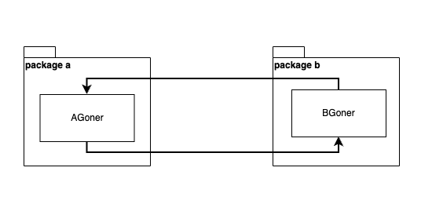

## Goner和依赖注入
### Goner的定义
在Gone应用中，所有的组件都被要求定义为Goner（就是“继承”了`gone.Flag`的结构体，实际上golang中根本没有“集成”这个概念，它有的只有匿名嵌套）；如果Goner的某个属性标注了`gone:""`标签，Gone框架将尝试自动装配该属性。下面是定义一个Goner的例子：
```go
package example

import "github.com/gone-io/gone"

type AGoner struct {
	gone.Flag
}
```
在另一个Goner中注入上面定义的AGoner:
```go
package example

import "github.com/gone-io/gone"

type BGoner struct{
    gone.Flag
    A *AGoner `gone:"*"` //gone标签的作用在于告诉Gone，该属性需要被自动注入一个值
}
```
其中，注入的和被注入的结构体都要求是`Goner`（也就是匿名嵌套了`gone.Flag`的结构体），`BGoner`的`A`属性的`gone:"*"`标签的作用在于告诉框架：这个属性需要被注入一个值。

### 在Gone中是如何完成依赖注入的？
在Java Spring中，给class打上`@Component`、`@Service`等标注，Spring启动时会自动扫描到这些特殊的类，然后实例化他们并且给他们有特定标注的属性注入对应的值。

Spring之所以能够实现这样的功能，Java有一个特性很关键，就是Java代码在编译成jar后，会保留所有class的字节码，哪怕是没有被`main`函数依赖的class代码；然而，在Golang中，编译后的代码会被裁剪，二进制文件中只会保留`main`函数依赖的相关代码。所以我们仅是定义Goner，在编译后我们会发现我们Goner代码全部被裁剪了。

如何让我们的**Goners**不被裁剪掉呢？答案很简单，我们显式的将所有Goner加入到一个”仓库“中；在Gone中，这个仓库叫做`Cemetery`。`Goner`有“死者”的意思；`Cemetery`是墓地，用于埋葬（Bury）`Goner`。我们可以在程序启动时，将所有的**Goner**实例化后并加入到**Cemetery**中：
```go
package main

import "example"
import "github.com/gone-io/gone"

func main() {
	gone.Run(func(cemetery gone.Cemetery) error {
        cemetery.Bury(&example.AGoner{})
		cemetery.Bury(&example.BGoner{})
        return nil
	})
}
```

在上面的代码中，我们看到`gone.Run`可以接收形式如 **`func (cemetery gone.Cemetery) error`** 的函数；实际上这个函数，我们称之为 **Priest**，是牧师的意思，他专门负责将 **Goner** 埋葬到 墓地（**Cemetery**）。

### 如何执行**Goner**中的业务代码？

在Gone中，我们做了一个有趣的定义：Goner所有属性都被注入后，我们称这个Goner被复活了（**Revive**）。如果你查看Gone的源代码，你会发现管理复活Goner状态的组件叫**Heaven**（**天堂**），这里灵感来源于各宗教神话中人死后会上天堂的传说。

为了执行**Goner**业务代码，我们可以在**Goner**上定义了方法 **`AfterRevive() gone.AfterReviveError`**，这个方法会在**Goner**被 **Revive** 后得到执行，并且我们将拥有该方法的 **Goner** 称之为 **Prophet**（也就是 **先知**）。实际上，一般情况我们只需要定义少量的先知来引导代码执行就可以了。


下面是一个例子；代码可以在[这里](https://github.com/gone-io/gone/blob/main/example/after-revive/main.go)找到：

```go
package main

import "github.com/gone-io/gone"

type Adder struct {
	gone.Flag
}

func (a *Adder) Add(a1, a2 int) int {
	return a1 + a2
}

type Computer struct {
	gone.Flag
	adder Adder `gone:"*"`
}

func (c *Computer) Compute() {
	println("I want to compute!")
	println("1000 add 2000 is", c.adder.Add(1000, 2000))
}

// AfterRevive 复活后执行的函数
func (c *Computer) AfterRevive() gone.AfterReviveError {
	// boot
	c.Compute()

	return nil
}

func main() {
	gone.Run(func(cemetery gone.Cemetery) error {
		cemetery.Bury(&Computer{})
		cemetery.Bury(&Adder{})
		return nil
	})
}
```
执行上面代码，将得到结果：  
```bash
Revive github.com/gone-io/gone/heaven
Revive github.com/gone-io/gone/cemetery
Revive main/Computer
Revive main/Adder
I want to compute!
1000 add 2000 is 3000
```


### gone命令，自动生成`Priest`函数

实际上，前面已经讲完了Gone框架的核心功能；然而由于Golang本身的问题，我们无法做到像Spring那么方便，需要手动把所有 **`Goner`** 加入（**`Bury`**）到 **`Cemetery`**。为了让Gone使用起来更方便，我们编写了一个辅助工具来自动生成 **`Priest`** 函数。下面介绍如何在一个项目中使用这个辅助工具。

> 完整代码可以在[这里](https://github.com/gone-io/gone/blob/main/example/gen-code)找到

#### 1. 安装辅助工具: gone

辅助工具和Gone框架同名，也叫gone，可以使用`go install`进行安装，如下：

```bash
go install github.com/gone-io/gone/tools/gone@latest
```

gone 命令的使用可以参考：[gone辅助工具](https://goner.fun/zh/references/gone-tool.html)


#### 2. 创建一个名为`gen-code`的新项目
```bash
mkdir gen-code
cd gen-code
go mod init gen-code
```

#### 3. 创建Goner
文件名：goner.go
```go
package main

import "github.com/gone-io/gone"

//go:gone
func NewAdder() gone.Goner {
	return &Adder{}
}

//go:gone
func NewComputer() gone.Goner {
	return &Computer{}
}

type Adder struct {
	gone.Flag
}

func (a *Adder) Add(a1, a2 int) int {
	return a1 + a2
}

type Computer struct {
	gone.Flag
	adder Adder `gone:"*"`
}

func (c *Computer) Compute() {
	println("I want to compute!")
	println("1000 add 2000 is", c.adder.Add(1000, 2000))
}

// AfterRevive 复活后执行的函数
func (c *Computer) AfterRevive() gone.AfterReviveError {
	// boot
	c.Compute()

	return nil
}
```

在上面代码中，请注意我们添加了两个工厂函数 `NewAdder() gone.Goner` 和 `func NewComputer() gone.Goner`，并且在函数前做了一个特殊的注释：
```go
//go:gone
```

请不要删除这个注释，这个注释的作用是告诉辅助工具如何生成代码的。

#### 4. 使用辅助工具
请在`gen-code`目录下执行下面命令：
```bash
gone priest -s . -p main -f Priest -o priest.go
```
这个命令的含义是，扫描当前目录生成一个 **牧师** 函数，它的函数名为 `Priest`，所在的包名为`main`，代码放到名为`priest.go`的文件中。
代码执行完后，会在当前目录中生成一个文件`priest.go`，它的内容如下：

```go
// Code generated by gone; DO NOT EDIT.
package main
import (
    "github.com/gone-io/gone"
)

func Priest(cemetery gone.Cemetery) error {
    cemetery.Bury(NewAdder())
    cemetery.Bury(NewComputer())
	return nil
}
```
#### 5. 添加`main`函数
文件名：main.go
```go
package main

import "github.com/gone-io/gone"

func main() {
	gone.Run(Priest)
}
```

至此，我们就完成了整个小的Gone程序，它的文件结构如下：
```bash
.
├── go.mod
├── go.sum
├── goner.go   #  goner的定义
├── main.go
└── priest.go  # 生成的代码
```

可以通过命令`go run .`来执行，程序将输出如下内容：
```code
Revive github.com/gone-io/gone/heaven
Revive github.com/gone-io/gone/cemetery
Revive main/Adder
Revive main/Computer
I want to compute!
1000 add 2000 is 3000
```

## 匿名注入与具名注入

在前面的篇章中，我们所有的例子实际上都是按类型的匿名注入；匿名注入时，如果存在多个同类型的**Goner**，被注入只会是其中一个，通常是最先被复活的那个。在Gone中，是支持按名字注入的（也就是**具名注入**）。

首先，**`Cemetery.Bury`** 函数的完整定义是这样的 **`Bury(Goner, ...GonerId) Cemetery`**，这样的定义有两层考虑：
- 1. 用于支持**具名埋葬**，第二个参数是可选的，允许传入一个字符串作为**Goner**的**ID**（**GonerId**）；
- 2. 使Bury函数支持链式调用。


### 具名埋葬

实现**具名埋葬**，我们的代码可以这样写：

```go
// Priest Responsible for putting Goners that need to be used into the framework
func Priest(cemetery gone.Cemetery) error {
	cemetery.
		Bury(&AGoner{Name: "Injected Goner1"}, "A1"). //埋葬第一个AGoner，ID=A1
		Bury(&AGoner{Name: "Injected Goner2"}, "A2"). //埋葬第二个AGoner，ID=A2
		Bury(&BGoner{})
	return nil
}
```
另外也可以这样写，这样写的好处是将Goner的构造和埋葬进行解耦：
```go
// NewA1 构造A1 AGoner
func NewA1() (gone.Goner, gone.GonerId) {
	return &AGoner{Name: "Injected Goner1"}, "A1"
}

// NewA2 构造A2 AGoner
func NewA2() (gone.Goner, gone.GonerId) {
	return &AGoner{Name: "Injected Goner2"}, "A2"
}

// Priest Responsible for putting Goners that need to be used into the framework
func Priest(cemetery gone.Cemetery) error {
	cemetery.
		Bury(NewA1()).
		Bury(NewA2()).
		Bury(&BGoner{})
	return nil
}
```

然后，就是结构体的具名注入，举个例子就能立刻明白：
```go
type BGoner struct {
	gone.Flag         //tell the framework that this struct is a Goner
	a         *AGoner `gone:"*"` //匿名注入一个AGoner
	a1        *AGoner `gone:"A1"` //具名注入A1
	a2        *AGoner `gone:"A2"` //具名注入A2
}
```
注意：上面代码，结构体属性后的标签：
- `gone:"*"`是按类型的**匿名注入**；
- `gone:"A1"`是注入`ID=A1`的AGoner的**具名注入**。

就是说，`gone`标签的值如果是`*`就是匿名注入；如果不是`*`，标签值就是要注入Goner的名字，也就是具名注入；当然，因为go是强类型的，所以无论 匿名注入 还是 具名注入 的 **Goner** 都必须是类型兼容的，否则注入失败。


## 指针注入、值注入 和 接口注入
如果被注入结构体的属性是一个指针，那么这个注入就是 **指针注入**；**值注入** 和**接口注入** 的定义也是类似的。让我们来举个例子：
```go
type AGoner struct {
	gone.Flag //tell the framework that this struct is a Goner
	Name      string
}

func (g *AGoner) Say() {
	println("I am the AGoner, My name is", g.Name)
}

type Speaker interface {
	Say()
}

type BGoner struct {
	gone.Flag         //tell the framework that this struct is a Goner
	a0         *AGoner `gone:"*"`  //匿名注入一个AGoner; 指针注入
	a1        *AGoner `gone:"A1"` //具名注入A1； 指针注入

	a2 AGoner  `gone:"A1"` // 值注入
	a3 Speaker `gone:"A2"` // 接口注入
}
```
上面代码中，`BGoner.a0` 和 `BGoner.a1` 是 **指针注入**；`BGoner.a2`是值注入；`BGoner.a3`是 **接口注入**。

**需要特别提醒：**“在go语言中，**值类型** 的赋值和传参都是传递的拷贝”，这意味着我们如果使用**值注入**时，实际上产生了一个新的“对象”，并且新旧对象只有在“传递那一刻”是相等，他们在内存中是独立的；这可能导致一些不符合“直觉”的结果，举个例子：

```go
type BGoner struct {
	gone.Flag

	a1 AGoner  `gone:"A1"` // 值注入
	a2 AGoner  `gone:"A1"` // 值注入
}

func (g *BGoner) AfterRevive() gone.AfterReviveError {
	g.a1.Name = "dapeng"
	g.a2.Name = "wang"

	fmt.Printf("a1 is eq a2: %v", g.a1 == g.a2)

	return nil
}

```
在上面的代码中，`BGoner.a1` 和 `BGoner.a2` 都被注入了 同一个 Goner（`A1` ），但是因为是**值注入**，注入的过程中框架实际能做的只有将 `A1` Goner 的值拷贝给了 `BGoner.a1` 和 `BGoner.a2`；`BGoner.a1` 和 `BGoner.a2`被注入后，就和`A1`没有了任何联系，`BGoner.a1` 和 `BGoner.a2`之间也没有联系，内存中也会有三份`AGoner`类型的空间占用；`fmt.代码Printf("a1 is eq a2: %v", g.a1 == g.a2)`打印的结果也会是 `false`。

> 考虑到**Gone**作为基础框架更多意义只是提供可能性，所以我们保留了 `值注入` 功能；而**大多数情况下，我们推荐使用 `指针注入` 和 `接口注入`**。

### 指针注入 vs 接口注入
在Goner的Bury过程中，要求传递的是一个引用，即`Cemetery.Bury`方法的第一个参数必须是引用类型。指针注入和接口注入都可以将 **Bury** 的引用传递给结构体的属性。**指针注入**，简单直观，类型间一一对应，没有什么过多需要讲解的。接口（interface）做为go语言中最精华的设计之一，语言设计之初目的就在于 **业务使用方和业务实现逻辑的解耦**，让接口的使用方不用关注实现的细节。接口的另一个作用是解除**循环依赖**，如果两个模块间存在循环引用并且他们位于不同的包中；这样会导致package的循环依赖，在go语言中是禁止这样的行为的，编译阶段会失败。我们可以如下使用接口来解出package间的循环依赖。

循环依赖：  


使用接口解除循环依赖：  


使用接口能够隐藏业务逻辑的实现细节，能够有效的降低模块间的耦合，也更好的遵守“开放封闭”原则；因此，我们推荐使用 **接口注入**。但是万事没有绝对，引入接口一定会增加额外的成本，所以我们还是支持了 **指针注入**。

## Slice注入和 Map注入
Gone 支持对`Slice`和`Map`进行注入，即支持如下写法的：
```go
type BGoner struct {
	gone.Flag

	aSlice1 []*AGoner `gone:"*"` //被注入的属性为Goner指针Slice
	aSlice2 []AGoner  `gone:"*"` //被注入的属性为Goner值Slice

	aMap1 map[string]*AGoner `gone:"*"` //被注入的属性为Goner指针的map
	aMap2 map[string]AGoner  `gone:"*"` //被注入的属性为Goner值的map
}
```
**注入的规则如下：**
- 1. Slice 和 Map 的元素类型可以是 Goner指针类型 和 Goner的值类型，也可以是一个接口；
- 2. Gone会将所有类型兼容的Goner注入到Slice 和 Map；
- 3. Map key的类型只能是string；
- 4. Map key的值为被注入Goner的GonerId，埋葬时没有指定GonerId的匿名Goner，Gone会自动生成一个Id。


::: warning
不推荐使用值作为Slice和Map的类型。
:::


下面是完整的例子：
```go
package main

import (
	"fmt"
	"github.com/gone-io/gone"
)

type AGoner struct {
	gone.Flag //tell the framework that this struct is a Goner
	Name      string
}

func (g *AGoner) Say() string {
	return fmt.Sprintf("I am the AGoner, My name is: %s", g.Name)
}

type BGoner struct {
	gone.Flag

	aSlice1 []*AGoner `gone:"*"` //被注入的属性为Goner指针Slice
	aSlice2 []AGoner  `gone:"*"` //被注入的属性为Goner值Slice

	aMap1 map[string]*AGoner `gone:"*"` //被注入的属性为Goner指针的map
	aMap2 map[string]AGoner  `gone:"*"` //被注入的属性为Goner值的map
}

// AfterRevive executed After the Goner is revived; After `gone.Run`, gone framework detects the AfterRevive function on goners and runs it.
func (g *BGoner) AfterRevive() gone.AfterReviveError {
	for _, a := range g.aSlice1 {
		fmt.Printf("aSlice1:%s\n", a.Say())
	}

	println("")

	for _, a := range g.aSlice2 {
		fmt.Printf("aSlice2:%s\n", a.Say())
	}

	println("")

	for k, a := range g.aMap1 {
		fmt.Printf("aMap1[%s]:%s\n", k, a.Say())
	}

	println("")

	for k, a := range g.aMap2 {
		fmt.Printf("aMap2[%s]:%s\n", k, a.Say())
	}

	return nil
}

// NewA1 构造A1 AGoner
func NewA1() (gone.Goner, gone.GonerId) {
	return &AGoner{Name: "Injected Goner1"}, "A1"
}

// NewA2 构造A2 AGoner
func NewA2() (gone.Goner, gone.GonerId) {
	return &AGoner{Name: "Injected Goner2"}, "A2"
}

func main() {

	gone.Run(func(cemetery gone.Cemetery) error {
		cemetery.
			Bury(NewA1()).
			Bury(&AGoner{Name: "Anonymous"}).
			Bury(NewA2()).
			Bury(&BGoner{})
		return nil
	})
}
```
例子执行的结果如下：
```bash
Revive github.com/gone-io/gone/heaven
Revive github.com/gone-io/gone/cemetery
Revive main/AGoner
Revive main/AGoner
Revive main/AGoner
Revive main/BGoner
aSlice1:I am the AGoner, My name is: Injected Goner1
aSlice1:I am the AGoner, My name is: Anonymous
aSlice1:I am the AGoner, My name is: Injected Goner2

aSlice2:I am the AGoner, My name is: Injected Goner1
aSlice2:I am the AGoner, My name is: Anonymous
aSlice2:I am the AGoner, My name is: Injected Goner2

aMap1[A1]:I am the AGoner, My name is: Injected Goner1
aMap1[main/AGoner#1374393662624]:I am the AGoner, My name is: Anonymous
aMap1[A2]:I am the AGoner, My name is: Injected Goner2

aMap2[A2]:I am the AGoner, My name is: Injected Goner2
aMap2[A1]:I am the AGoner, My name is: Injected Goner1
aMap2[main/AGoner#1374393662624]:I am the AGoner, My name is: Anonymous
```


## 私有属性注入
根据“开发封闭”原则，模块依赖的属性应该是私有的，Gone支持对结构体的私有变量注入。

## [配置注入](./guide/config.md)