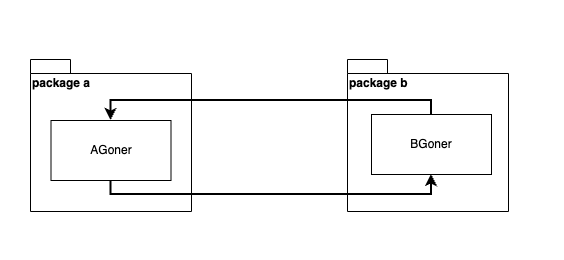
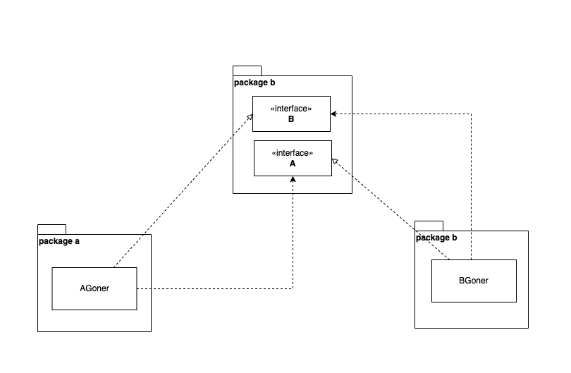
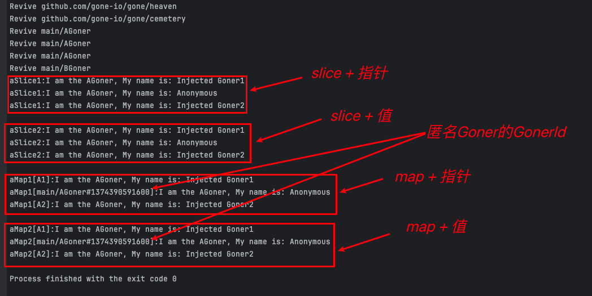

# Gone支持哪些方式注入？

[[toc]]

## 共有属性注入 vs 私有属性注入
在Gone中，及支持共有属性注入也支持私有属性注入。依赖注入，一般情况依赖注入的“对象”都只应该局限于模块内部使用，基于“开放封闭”原则，我推荐使用私有属性注入。

::: tip
推荐私有属性注入
:::

举个例子：
```go
package demo
import "github.com/gone-io/gone"

type Worker struct {
	gone.Flag // Goner标志，匿名内嵌`gone.Flag`表示该结构体为一个Goner
	Name      string
}

type Boss struct {
    gone.Flag // Goner标志，匿名内嵌`gone.Flag`表示该结构体为一个Goner

    seller  *Worker `gone:"seller"`  //属性首字母为小写，为私有属性注入，只能包内部访问
    Manager *Worker `gone:"manager"` //属性首字母为大写，为公有属性注入，访问不受限制
}
```


## 匿名注入 vs 具名注入

### 匿名埋葬 和 具名埋葬
需要注入一个Goner，必须先要将其载入到系统，在gone中，我们称之为**埋葬**（也就是**Bury**），就是在**Priest**函数中，调用`cemetery.Bury`函数将Goner的引用“埋葬”到**墓园（cemetery）**。埋葬时，如果不指定了GonerId，就是**匿名埋葬**；如果指定了就是**具名埋葬**。

**`Cemetery.Bury`** 函数的完整定义是这样的 **`Bury(Goner, ...GonerId) Cemetery`**，这样的定义有两层考虑：
1. 用于支持**具名埋葬**，第二个参数是可选的，允许传入一个字符串作为**Goner**的**ID**（**GonerId**）；
2. 使Bury函数可以支持链式调用。

**举个例子：**
```go
func Priest(cemetery gone.Cemetery) error {
	cemetery.
		Bury(&AGoner{Name: "Injected Goner1"}, "A1"). //具名埋葬第一个AGoner，ID=A1
		Bury(&AGoner{Name: "Injected Goner2"}, "A2"). //具名埋葬第二个AGoner，ID=A2
		Bury(&BGoner{}) //匿名埋葬
	return nil
}
```

::: tip
实际上，匿名埋葬的Goner也会被Gone随机分配一个GoneId。
:::

### 匿名注入
注入时，没有指明被注入Goner的GonerId就是匿名注入，即注入标签为`gone:"*"`。

**举个例子：**
```go
type Boss struct {
    gone.Flag // Goner标志，匿名内嵌`gone.Flag`表示该结构体为一个Goner

    seller  *Worker `gone:"*"`  //匿名注入
}
```
::: danger
匿名注入时，如果存在 多个 兼容类型的**Goner**，被注入只会是其中一个，通常是最先被 复活（Revive）的那个，可能会导致未定义行为。举个例子：
```go
package main

import "github.com/gone-io/gone"

type Worker struct {
	gone.Flag // Goner标志，匿名内嵌`gone.Flag`表示该结构体为一个Goner
	Name      string
}

type Boss struct {
	gone.Flag // Goner标志，匿名内嵌`gone.Flag`表示该结构体为一个Goner

	seller *Worker `gone:"*"` //匿名注入，如果有存在多个Worker，则注入其中一个，通常是第一个
}

func main() {
	gone.Run(func(cemetery gone.Cemetery) error {
		cemetery.Bury(&Boss{})
		cemetery.Bury(&Worker{Name: "小王"})
		cemetery.Bury(&Worker{Name: "小张"})
		return nil
	})
}
```
:::


### 具名注入
注入时，指明了Goner的GonerId，就是具名注入；具名注入能够根据名字准确的帮我们注入一个Goner，在实际开发中很有用。需要注意的是：
1. 需要确保存在响应GonerId的Goner被埋葬到了墓园；
2. 因为go是强类型的，所以无论 匿名注入 还是 具名注入 的 Goner 都必须是类型兼容的，否则注入失败。

**举个例子：**
```go
type Boss struct {
    gone.Flag // Goner标志，匿名内嵌`gone.Flag`表示该结构体为一个Goner
    Manager *Worker `gone:"manager"` //具名注入
}
```

## 支持注入的属性类型

### 1.指针类型
被注入的Goner属性是一个指针时，我们也称之为**指针注入**。

**举个例子**
```go
type Worker struct {
	gone.Flag
	Name      string
}

type Boss struct {
    gone.Flag
    seller  *Worker `gone:"seller"`  //指针类型
}
```


### 2.值类型
被注入的Goner属性是一个值类型时，我们也称之为**值注入**。

**举个例子**
```go
type Worker struct {
	gone.Flag
	Name      string
}

type Boss struct {
    gone.Flag
    seller  Worker `gone:"seller"`  //值类型
}
```


::: danger
“在go语言中，**值类型** 的赋值和传参都是传递的拷贝”，这意味着我们如果使用 **值类型** 注入时，实际上产生了一个新的“对象”，并且新旧对象只有在“传递那一刻”是相等，他们在内存中是独立的；这可能导致一些不符合“直觉”的结果，举个例子：

```go
type BGoner struct {
	gone.Flag

	a1 AGoner  `gone:"A1"` // 值注入
	a2 AGoner  `gone:"A1"` // 值注入
}

func (g *BGoner) AfterRevive() gone.AfterReviveError {
	g.a1.Name = "dapeng"
	g.a2.Name = "wang"

	fmt.Printf("a1 is eq a2: %v", g.a1 == g.a2)

	return nil
}

```
在上面的代码中，打印的结果会是 `false`。
:::

### 3.接口类型
被注入的Goner属性是一个接口类型时，我们也称之为**接口注入**。

**举个例子**
```go
type Seller interface {
    Sell() error
}

type Boss struct {
    gone.Flag
    seller Seller `gone:"seller"`  //接口类型
}
```


### 4.Slice 类型
被注入的Goner属性是一个Slice类型时，我们也称之为**Slice注入**；在Slice注入中，Slice的元素类型允许为 值类型、指针类型 和 接口类型；由于值类型的“拷贝传递”，我们不推荐使用。

**举个例子**
```go
type Worker struct {
	gone.Flag
	Name      string
}

type Seller interface {
    Sell() error
}

type Boss struct {
    gone.Flag
    sellers []Seller  `gone:"*"`  //Slice 类型，元素为接口类型
    workers []*Worker `gone:"*"`   //Slice 类型，元素为指针类型
    persons []Worker  `gone:"*"`   //Slice 类型，元素为值类型
}
```

### 5.Map 类型
被注入的Goner属性是一个Map类型时，我们也称之为**Map注入**；在Map注入中，Map的元素类型允许为 值类型、指针类型 和 接口类型；由于值类型的“拷贝传递”，我们不推荐使用；Map的key只能为`string`类型，被注入后map key的值为GonerId。

**举个例子**
```go
type Worker struct {
	gone.Flag
	Name      string
}

type Seller interface {
    Sell() error
}

type Boss struct {
    gone.Flag
    sellers map[string]Seller  `gone:"*"`  //Map 类型，元素为接口类型
    workers map[string]*Worker `gone:"*"`   //Map 类型，元素为指针类型
    persons map[string]Worker  `gone:"*"`   //Map 类型，元素为值类型
}
```

### 指针注入 vs 接口注入
在Goner的Bury过程中，要求传递的是一个引用，即`Cemetery.Bury`方法的第一个参数必须是引用类型。指针注入和接口注入都可以将 **Bury** 的引用传递给结构体的属性。**指针注入**，简单直观，类型间一一对应，没有什么过多需要讲解的。接口（interface）做为go语言中最精华的设计之一，语言设计之初目的就在于 **业务使用方和业务实现逻辑的解耦**，让接口的使用方不用关注实现的细节。接口的另一个作用是解除**循环依赖**，如果两个模块间存在循环引用并且他们位于不同的包中；这样会导致package的循环依赖，在go语言中是禁止这样的行为的，编译阶段会失败。我们可以如下使用接口来解出package间的循环依赖。

循环依赖：  


使用接口解除循环依赖：  


使用接口能够隐藏业务逻辑的实现细节，能够有效的降低模块间的耦合，也更好的遵守“开放封闭”原则；因此，我们推荐使用 **接口注入**。但是万事没有绝对，引入接口一定会增加额外的成本，所以我们还是支持了 **指针注入**。

### Slice注入 vs Map注入
Gone 支持对`Slice`和`Map`进行注入，即支持如下写法的：
```go
type BGoner struct {
	gone.Flag

	aSlice1 []*AGoner `gone:"*"` //被注入的属性为Goner指针Slice
	aSlice2 []AGoner  `gone:"*"` //被注入的属性为Goner值Slice

	aMap1 map[string]*AGoner `gone:"*"` //被注入的属性为Goner指针的map
	aMap2 map[string]AGoner  `gone:"*"` //被注入的属性为Goner值的map
}
```
**注入的规则如下：**
- 1. Slice 和 Map 的元素类型可以是 Goner指针类型 和 Goner的值类型，也可以是一个接口；
- 2. Gone会将所有类型兼容的Goner注入到Slice 和 Map；
- 3. Map key的类型只能是string；
- 4. Map key的值为被注入Goner的GonerId，埋葬时没有指定GonerId的匿名Goner，Gone会自动生成一个Id。


::: danger
不推荐使用值作为Slice和Map的类型。
:::


下面是完整的例子：
```go
package main

import (
	"fmt"
	"github.com/gone-io/gone"
)

type AGoner struct {
	gone.Flag //tell the framework that this struct is a Goner
	Name      string
}

func (g *AGoner) Say() string {
	return fmt.Sprintf("I am the AGoner, My name is: %s", g.Name)
}

type BGoner struct {
	gone.Flag

	aSlice1 []*AGoner `gone:"*"` //被注入的属性为Goner指针Slice
	aSlice2 []AGoner  `gone:"*"` //被注入的属性为Goner值Slice

	aMap1 map[string]*AGoner `gone:"*"` //被注入的属性为Goner指针的map
	aMap2 map[string]AGoner  `gone:"*"` //被注入的属性为Goner值的map
}

// AfterRevive executed After the Goner is revived; After `gone.Run`, gone framework detects the AfterRevive function on goners and runs it.
func (g *BGoner) AfterRevive() gone.AfterReviveError {
	for _, a := range g.aSlice1 {
		fmt.Printf("aSlice1:%s\n", a.Say())
	}

	println("")

	for _, a := range g.aSlice2 {
		fmt.Printf("aSlice2:%s\n", a.Say())
	}

	println("")

	for k, a := range g.aMap1 {
		fmt.Printf("aMap1[%s]:%s\n", k, a.Say())
	}

	println("")

	for k, a := range g.aMap2 {
		fmt.Printf("aMap2[%s]:%s\n", k, a.Say())
	}

	return nil
}

// NewA1 构造A1 AGoner
func NewA1() (gone.Goner, gone.GonerId) {
	return &AGoner{Name: "Injected Goner1"}, "A1"
}

// NewA2 构造A2 AGoner
func NewA2() (gone.Goner, gone.GonerId) {
	return &AGoner{Name: "Injected Goner2"}, "A2"
}

func main() {

	gone.Run(func(cemetery gone.Cemetery) error {
		cemetery.
			Bury(NewA1()).
			Bury(&AGoner{Name: "Anonymous"}).
			Bury(NewA2()).
			Bury(&BGoner{})
		return nil
	})
}
```
例子执行的结果如下：


