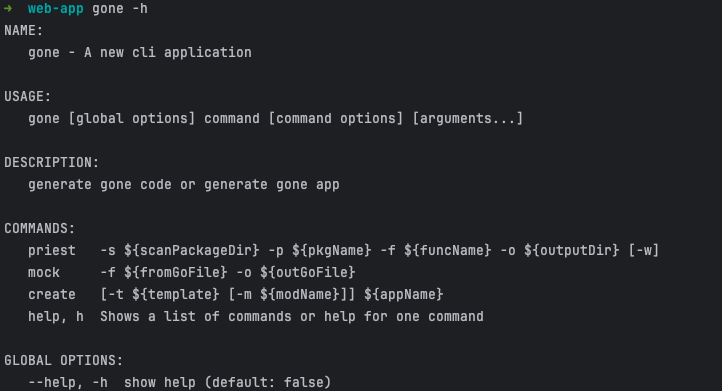
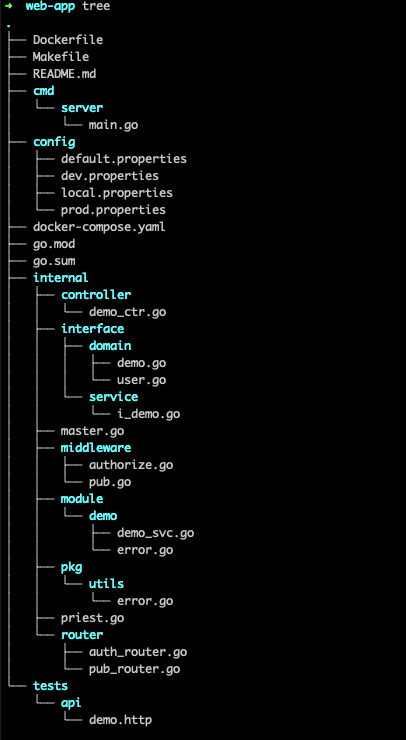
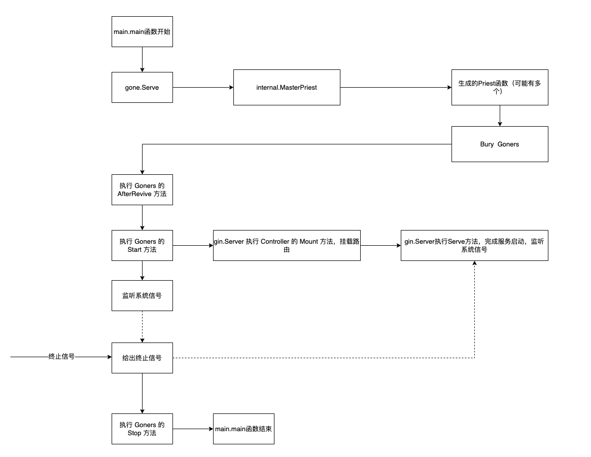

# 快速开始

## 安装gone辅助工具
```bash
go install github.com/gone-io/gone/tools/gone@latest
```

> 安装可以使用gone命令：
> ```bash
> gone -h
> ```
> 
> 支持的功能：
> 1. create，创建一个gone app，暂时只支持创建web app
> 2. priest，为项目自动生成 **Priest** 函数，[了解更多](../)
> 3. 生成用于测试的mock代码

## 创建一个web项目并运行代码

```bash
# 创将一个名为 web-app 的项目
gone create web-app
cd web-app
make run
```
## 项目结构


- cmd/server/main.go: 启动文件，main函数所在文件
- config/: 项目配置文件目录，支持`.properties`文件
- internal/router/: 在该目录定义路由器
- internal/middleware/: 中间件目录，如果需要定义web中间件，在该目录编写
- internal/controller/: controller目录，在该目录中的文件定义路由
- internal/interface/service/: 该目录放服务的接口定义
- internal/domain/: 该目录放领域对象
- internal/entity/: 该目录放一些无逻辑的结构体，类似于Java 的POJO
- internal/module/: 模块目录，下面的每一个子目录实现一个模块的功能，一般是internal/interface/service/中定义的服务的业务实现；
- internal/pkg/: 在该目录可以放一些项目共用的工具代码
- internal/master.go: 存放**MasterPriest**函数
- internal/priest.go: gone priest 命令生成的 **Priest**函数，用于**埋葬**所有Goner

## Router
在目录`internal/router`中分别实现了两个`gin.IRouter`:
- pubRouter，公开的路由，挂载在该路由下的接口，请求将无需授权即可访问。
- authRouter，鉴权的路由，挂载在该路由下的接口，请求必须先要经过授权。

我们来分析`internal/router/pub_router.go`的代码：
```go
package router

import (
	"web-app/internal/middleware"
	"github.com/gone-io/gone"
	"github.com/gone-io/gone/goner/gin"
)

const IdRouterPub = "router-pub"

//go:gone
func NewPubRouter() (gone.Goner, gone.GonerId) {
	return &pubRouter{}, IdRouterPub
}

type pubRouter struct {
	gone.Flag
	gin.IRouter
	root gin.IRouter               `gone:"gone-gin-router"`
	pub  *middleware.PubMiddleware `gone:"*"`
}

func (r *pubRouter) AfterRevive() gone.AfterReviveError {
	r.IRouter = r.root.Group("/api", r.pub.Next)
	return nil
}
```

1. 对于router，需要实现了`gin.IRouter`接口中定义的方法；
2. 结构体`pubRouter`内嵌了一个`gin.IRouter`，就等于直接实现了`gin.IRouter`接口，只在`AfterRevive()`中将其赋予一个值就可以了；
3. `r.IRouter = r.root.Group("/api", r.pub.Next)`意思是当前路由是根路由下`/api`的子路由，并且默认的增加了一个中间`r.pub.Next`；
4. `root gin.IRouter`是一个Gone框架中`github.com/gone-io/gone/goner/gin`包提供的一个框架级Goner，具名注入的`gone-gin-router`。


## Controller

下面是Controller接口的定义：
```go
// Controller 控制器接口，由业务代码编码实现，用于挂载和处理路由
// 使用方式参考 [示例代码](https://gitlab.openviewtech.com/gone/gone-example/-/tree/master/gone-app)
type Controller interface {
	// Mount   路由挂载接口，改接口会在服务启动前被调用，该函数的实现通常情况应该返回`nil`
	Mount() MountError
}
```


编写http接口，我们需要实现`Controller`接口，在`Mount`方法中实现接口路由的挂载，如`internal/controller/demo_ctr.go`的代码：
```go
package controller

import (
	"web-app/internal/interface/service"
	"web-app/internal/pkg/utils"
	"github.com/gone-io/gone"
	"github.com/gone-io/gone/goner/gin"
)

//go:gone
func NewDemoController() gone.Goner {
	return &demoController{}
}

type demoController struct {
	gone.Flag
	demoSvc service.IDemo `gone:"*"`  //注入依赖的服务

	authRouter gin.IRouter `gone:"router-auth"`  //注入路由器
	pubRouter  gin.IRouter `gone:"router-pub"`   //注入路由器
}

func (ctr *demoController) Mount() gin.MountError {

	//需要鉴权的路由分组
	ctr.
		authRouter.
		Group("/demo").
		GET("/show", ctr.showDemo)

	//不需要鉴权的路由分组
	ctr.
		pubRouter.
		Group("/demo2").
		GET("/show", ctr.showDemo).
		GET("/error", ctr.error).
		GET("/echo", ctr.echo)

	return nil
}

func (ctr *demoController) showDemo(ctx *gin.Context) (any, error) {
	return ctr.demoSvc.Show()
}

func (ctr *demoController) error(ctx *gin.Context) (any, error) {
	return ctr.demoSvc.Error()
}

func (ctr *demoController) echo(ctx *gin.Context) (any, error) {
	type Req struct {
		Echo string `form:"echo"`
	}

	var req Req
	if err := ctx.Bind(&req); err != nil {
		return nil, gin.NewParameterError(err.Error(), utils.ParameterParseError)
	}
	return ctr.demoSvc.Echo(req.Echo)
}
```


## Service
规范上，我们要求将服务的接口定义在`internal/interface/service`目录，文件名以`i_`打头，接口类型以`I`打头，例如：
文件：i_demo.go
```go
package service

import "web-app/internal/interface/domain"

type IDemo interface {
	Show() (*domain.DemoEntity, error)
	Echo(input string) (string, error)
	Error() (any, error)
}
```
服务的逻辑实现，放到`internal/module`目录分模块实现。


## [数据库](https://goner.fun/zh/guide/xorm.html)


## 服务启动流程


服务的启动从 **gone.Serve** 开始，该函数可以接收一个或者多个**Priest**函数，**Priest**函数负责将 **Goners**“埋葬**Bury**”到**Cemetery**。**gone.Serve**在所有的**Goners**复活后，等待系统信号，主goroutine将阻塞，具体的业务留给**Angel**通过**Start**方法开启新的goroutine来完成。
在**Gone**中，几乎所有的组件（包括内置的组件）都是**Goner**。