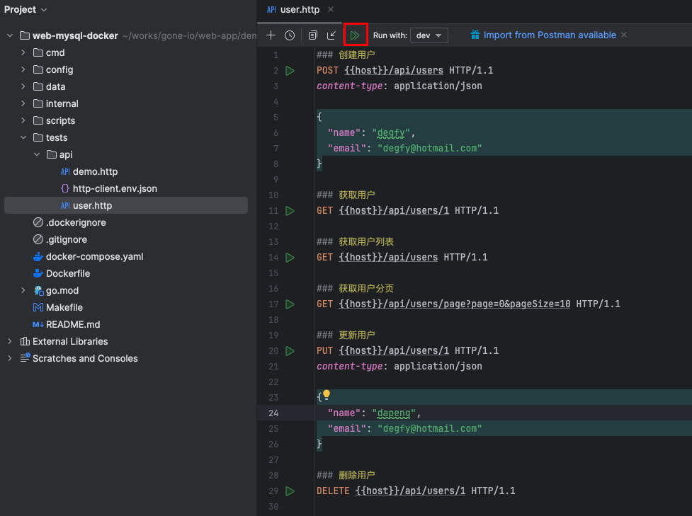
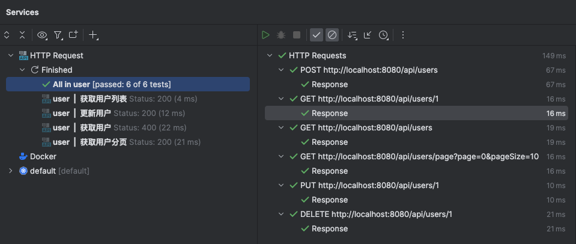

# Web + MySQL
在本文中，我将演示如何创建一个可运行在生产环境的Web项目，并对项目做简单的介绍。项目的使用MySql作为数据库，使用docker-compose管理容器。

## 安装gone辅助工具
```bash
go install github.com/gone-io/gonectr@latest
go install go.uber.org/mock/mockgen@latest
```
关于gone命令，更多参考：[gone辅助工具](https://goner.fun/zh/references/gone-tool.html)

## 创建项目

```bash
gonectr create -t web+mysql web-mysql-docker
```
上面命令会在当前目录中创建一个名为web-mysql-docker的目录。

## 编译并运行
> 假设你已经安装了`make`；如果没有安装请先安装，参考：[安装make](https://blog.csdn.net/waitdeng/article/details/138849321)。  
> 建设你已经安装了`docker` 和 `docker compose`；如果没有，参考: https://docs.docker.com/engine/install/。

执行系列命令
```bash
# 进入项目目录
cd web-mysql-docker

# 启动MySql服务
docker compose up -d mysql

# 编译并运行
make run
```
日志打印如下：
```bash
➜  web-mysql-docker make run
make gone
make install-gone
go install github.com/gone-io/gone/tools/gone@latest
go mod tidy
go generate ./...
go run cmd/server/main.go
2024-05-14 12:42:03.574|INFO|Init|Revive github.com/gone-io/gone/heaven
2024-05-14 12:42:03.574|INFO|Init|Revive github.com/gone-io/gone/cemetery
2024-05-14 12:42:03.574|INFO|Init|Revive github.com/gone-io/gone/goner/tracer/tracer
2024-05-14 12:42:03.574|INFO|Init|Revive github.com/gone-io/gone/goner/logrus/logger
2024-05-14 12:42:03.574|INFO|Init|Revive github.com/gone-io/gone/goner/config/config
2024-05-14 12:42:03.574|INFO|Init|Revive github.com/gone-io/gone/goner/config/propertiesConfigure
2024-05-14 12:42:03.574|INFO|Init|Revive github.com/gone-io/gone/goner/logrus/logger
2024-05-14 12:42:03.574|INFO|Init|==>Use Env: local
2024-05-14 12:42:03.574|WARNING|Init|properties: /var/folders/jv/rn9b7nhs2ls1n1j_lqj005r80000gn/T/go-build521033176/b001/exe/config/default.properties not found. skipping
2024-05-14 12:42:03.574|WARNING|Init|properties: /var/folders/jv/rn9b7nhs2ls1n1j_lqj005r80000gn/T/go-build521033176/b001/exe/config/local.properties not found. skipping
2024-05-14 12:42:03.575|INFO|Init|Revive github.com/gone-io/gone/goner/config/config
2024-05-14 12:42:03.575|INFO|Init|Revive github.com/gone-io/gone/goner/config/propertiesConfigure
2024-05-14 12:42:03.575|INFO|Init|Revive github.com/gone-io/gone/goner/xorm/engine
2024-05-14 12:42:03.575|INFO|Init|Revive github.com/gone-io/gone/goner/cmux/server
2024-05-14 12:42:03.575|INFO|Init|Revive github.com/gone-io/gone/goner/gin/proxy
2024-05-14 12:42:03.575|INFO|Init|Revive github.com/gone-io/gone/goner/gin/router
2024-05-14 12:42:03.575|INFO|Init|Revive github.com/gone-io/gone/goner/gin/sysProcessor
2024-05-14 12:42:03.575|INFO|Init|Revive github.com/gone-io/gone/goner/gin/responser
2024-05-14 12:42:03.575|INFO|Init|Revive github.com/gone-io/gone/goner/gin/server
2024-05-14 12:42:03.575|INFO|Init|Revive github.com/gone-io/gone/goner/gin/httpInjector
2024-05-14 12:42:03.575|INFO|Init|Revive web-mysql/internal/controller/demoController
2024-05-14 12:42:03.575|INFO|Init|Revive web-mysql/internal/middleware/AuthorizeMiddleware
2024-05-14 12:42:03.575|INFO|Init|Revive web-mysql/internal/middleware/PubMiddleware
2024-05-14 12:42:03.575|INFO|Init|Revive web-mysql/internal/module/demo/db
2024-05-14 12:42:03.575|INFO|Init|Revive web-mysql/internal/module/demo/demoService
2024-05-14 12:42:03.575|INFO|Init|Revive web-mysql/internal/router/authRouter
2024-05-14 12:42:03.575|INFO|Init|Revive web-mysql/internal/router/pubRouter
[GIN-debug] [WARNING] Running in "debug" mode. Switch to "release" mode in production.
 - using env:   export GIN_MODE=release
 - using code:  gin.SetMode(gin.ReleaseMode)

[GIN-debug] GET    /api/demo/show            --> github.com/gone-io/gone/goner/gin.(*proxy).Proxy.(*proxy).proxyOne.func5 (8 handlers)
[GIN-debug] GET    /api/demo2/show           --> github.com/gone-io/gone/goner/gin.(*proxy).Proxy.(*proxy).proxyOne.func5 (7 handlers)
[GIN-debug] GET    /api/demo2/error          --> github.com/gone-io/gone/goner/gin.(*proxy).Proxy.(*proxy).proxyOne.func5 (7 handlers)
[GIN-debug] GET    /api/demo2/echo           --> github.com/gone-io/gone/goner/gin.(*proxy).Proxy.(*proxy).proxyOne.func5 (7 handlers)
[GIN-debug] GET    /api/inject-query         --> github.com/gone-io/gone/goner/gin.(*proxy).Proxy.(*proxy).proxyOne.func8 (7 handlers)
[GIN-debug] GET    /api/inject/:key          --> github.com/gone-io/gone/goner/gin.(*proxy).Proxy.(*proxy).proxyOne.func8 (7 handlers)
[GIN-debug] POST   /api/inject-http-body     --> github.com/gone-io/gone/goner/gin.(*proxy).Proxy.(*proxy).proxyOne.func8 (7 handlers)
[GIN-debug] GET    /api/inject-http-struct   --> github.com/gone-io/gone/goner/gin.(*proxy).Proxy.(*proxy).proxyOne.func8 (7 handlers)
[GIN-debug] POST   /api/users                --> github.com/gone-io/gone/goner/gin.(*proxy).Proxy.(*proxy).proxyOne.func8 (7 handlers)
[GIN-debug] GET    /api/users                --> github.com/gone-io/gone/goner/gin.(*proxy).Proxy.(*proxy).proxyOne.func8 (7 handlers)
[GIN-debug] GET    /api/users/page           --> github.com/gone-io/gone/goner/gin.(*proxy).Proxy.(*proxy).proxyOne.func8 (7 handlers)
[GIN-debug] GET    /api/users/:id            --> github.com/gone-io/gone/goner/gin.(*proxy).Proxy.(*proxy).proxyOne.func8 (7 handlers)
[GIN-debug] PUT    /api/users/:id            --> github.com/gone-io/gone/goner/gin.(*proxy).Proxy.(*proxy).proxyOne.func8 (7 handlers)
[GIN-debug] DELETE /api/users/:id            --> github.com/gone-io/gone/goner/gin.(*proxy).Proxy.(*proxy).proxyOne.func8 (7 handlers)
2024-05-14 12:42:03.576|INFO|/Users/jim/go/pkg/mod/github.com/gone-io/gone@v0.3.1/goner/gin/server.go:46||Server Listen At :8080
2024-05-14 12:42:03.576|INFO|/Users/jim/go/pkg/mod/xorm.io/xorm@v1.3.2/log/logger_context.go:90||PING DATABASE mysql
2024-05-14 12:42:03.585|INFO|/Users/jim/go/pkg/mod/github.com/gone-io/gone@v0.3.1/cemetery.go:329||Revive [Anonymous Goner]
2024-05-14 12:42:03.585|INFO|/Users/jim/works/gone-io/web-app/demo/web-mysql-docker/cmd/server/main.go:28||before start
```

## 测试接口
我这里使用Goland内置Http Request插件测试。
使用Goland打开项目，打开文件`tests/api/user.http`，选择`dev`环境运行，如下：


执行结果：


## 项目简单介绍

### 目录结构
```bash
├── Dockerfile
├── Makefile
├── README.md
├── cmd
│   └── server
│       └── main.go #项目main方法所在文件
├── config          #项目配置目录
│   ├── default.properties #默认配置
│   ├── dev.properties     #开发环境配置
│   ├── local.properties   #本地环境配置
│   └── prod.properties    #生产环境配置
├── docker-compose.yaml    # docker-compose，定义了mysql 和 web 两个容器
├── go.mod
├── internal
│   ├── controller         #Controller
│   │   └── demo_ctr.go
│   ├── interface          #接口目录
│   │   ├── domain         #领域模型
│   │   │   ├── demo.go
│   │   │   ├── page.go
│   │   │   └── user.go
│   │   ├── entity         #实体模型
│   │   │   └── User.go
│   │   └── service        #服务接口
│   │       └── i_demo.go  #一个文件一般只放一个接口，文件名以`i_开口`，接口名以 `I`卡头，比如`IDemo`
│   ├── master.go
│   ├── middleware         #中间件目录，可以定义鉴权等统一处理逻辑
│   │   ├── authorize.go
│   │   └── pub.go
│   ├── module             #模块目录
│   │   └── demo           #demo模块
│   │       ├── db.go      #demo目录的数据库接口的实现
│   │       ├── demo_svc.go #demo Service，实现了`service.IDemo`接口
│   │       ├── error.go    # 当前目录错误码定义
│   │       └── i_db.go    #demo目录的数据库接口
│   ├── pkg                #公共工具目录
│   │   └── utils
│   │       └── error.go
│   ├── priest.go         #gone create 创建是没有该文件，运行 `make gone`生成的
│   └── router            #路由目录
│       ├── auth_router.go # 定义了需要鉴权的的路由组
│       └── pub_router.go  # 定义了无需鉴权的的路由组
├── scripts                # 脚本目录，用于存放一些脚本
│   └── mysql
│       └── initdb.d       #mysql initdb.d目录，docker-compose中定义的mysql首次启动时 会执行该目录下所有sql文件
│           └── user.sql
└── tests                  #集成测试目录
    └── api                #接口测试目录
        ├── demo.http
        ├── http-client.env.json
        └── user.http
```

### 项目特点
- 开箱可用，无需额外配置直接可以运行
- 生成了`Dockerfile`，方便部署到各种容器环境
- 使用Makefile整合了gone、go、docker、docker compose等命令
- 自动生成Priest函数，使开发更顺畅
- 使用了gone框架，引入了依赖注入
- 使用接口解耦
- 支持分环境编写配置
- 集成了MySQL数据库

### 部分代码讲解
```go
//...
	// demo数据 user 的增删改查，挂载到authRouter只为方便演示
	ctr.
		pubRouter.
		Group("/users").
		POST("", func(in struct {
            //Body注入，根据contentType将HTTP正文解析为一个结构体，支持json、xml、form-data、x-www-form-urlencoded 等 contentType
			req *domain.User `gone:"http,body"`
		}) error {
			return ctr.demoSvc.CreateUser(in.req)
		}).
		GET("", func() (any, error) {
			return ctr.demoSvc.ListUsers()
		}).
		GET("/page", func(in struct {
			query domain.PageQuery `gone:"http,query"` //Query注入
		}) (any, error) {
			return ctr.demoSvc.PageUsers(in.query)
		}).
		GET("/:id", func(in struct {
			id int64 `gone:"http,param"`              //Url参数注入，将注入路由上定义的`:id`
		}) (any, error) {
			return ctr.demoSvc.GetUserById(in.id)
		}).
		PUT("/:id", func(in struct {
			id  int64        `gone:"http,param"` //Url参数注入，将注入路由上定义的`:id`
			req *domain.User `gone:"http,body"`  //Body注入
		}) error {
			return ctr.demoSvc.UpdateUserById(in.id, in.req)
		}).
		DELETE("/:id", func(in struct {
			id int64 `gone:"http,param"` //Url参数注入，将注入路由上定义的`:id`
		}) error {
			return ctr.demoSvc.DeleteUser(in.id)
		})
//...
```
上面代码截取于`internal/controller/demo_ctr.go`文件。

### HTTP 注入

可以看到，**Gone**在路由处理函数上也支持了**依赖注入**；注入的方式是在使用一个匿名结构体作为处理函数的入参，并给结构体属性做特殊标记。
上面代码用的注入标签：
- `gone:"http,body"`，Body注入，根据contentType将HTTP正文解析为一个结构体，支持json、xml、form-data、x-www-form-urlencoded 等 contentType，要求被注入的结构体属性的数据类型为**结构体**或者**结构体指针**；
- `gone:"http,query"`，Query注入，被注入的结构体属性的数据类型可以为**结构体**、**结构体指针**、**字符串**、**Number（int、uint、float64 ...）** 和 **字符串或Number的Slice**；
- `gone:"http,param"`，Url参数注入，将注入路由上定义的参数；要求被注入的结构体属性的数据类型为**字符串**或**Number类型**。

下面对Query注入，句几个例子：
```go
type Q struct {
    Page int `form:"page"` //使用form标签指定参数名为page，默认是属性名Page
    PageSize int `form:"pageSize"`//使用form标签指定参数名为pageSize，默认是属性名PageSize
}

func handle(in struct{
    page int `gone:"http,query"` //未指定query参数名，去属性名为key
    thePage int `gone:"http,query=page"`//指定query参数名为page
    size int64 `gone:"http,query=pageSize` //指定query参数名为pageSize

    q *Q `gone:"http,query"` //被注入类型为一个结构体
    keywords []string `gone:"http,query=keywords"` //使用数组结构，允许Query参数出现多次
    oneKeyword string `gone:"http,query=keywords"` //不使用数组，只获取Query中的第一个keyword
}){
    //todo
}
```
假设某个请求的Query为：`?page=10&pageSize=20&keywords=today&keywords=weather`，使用上面`handle`处理请求，参数`in`的值如下：

- `in.page`  = 10
- `in.thePage` = 10
- `in.size` = 20
- `in.q` = {Page = 10, PageSize = 20}
- `in.keywords` = [today, weather]
- `in.oneKeyword` = today

另外，处理函数还支持注入一些特殊结构体或指针（推荐使用指针）：
- `gone.Content` 请求上下文
- `http.Request` Http请求
- `http.Header`  请求头
- `url.Url` url

框架还支持更多的注入标签和类型，请参考文档[http 注入说明](https://goner.fun/zh/references/http-inject.html)

### 请求处理函数参数
请求处理函数返回参数可以为如下几种形式：
1. 不返回参数
2. 返回一个非`error`的参数
3. 返回数据和`error`
